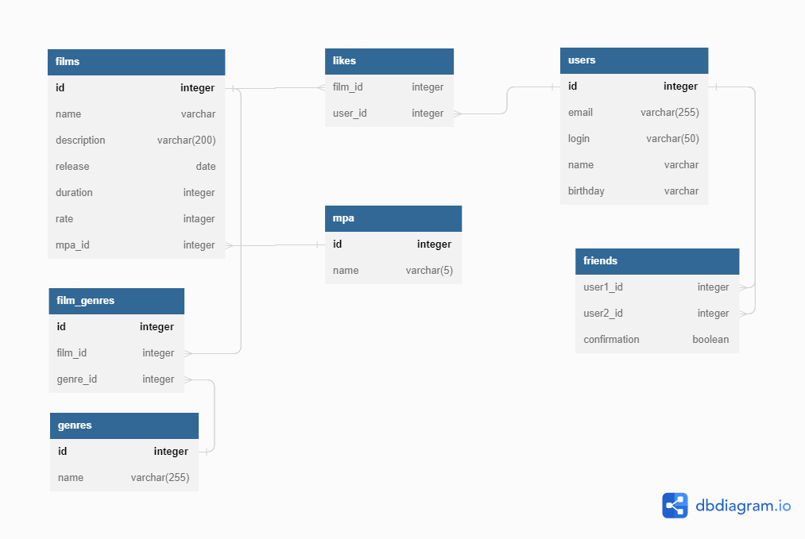

# java-filmorate
Диаграмма базы данных:

### Основные запросы:
#### Добавление фильма:
insert into films(id, name, description, release, duration, rating)
values(1, 'nisi eiusmod', 'adipisicing', cast('25.03.1967' as date), 100, 'G');
#### Редактирование фильма:
update films
set name = 'Film Updated',
release = cast('17.04.1989' as date),
description = 'New film update decription',
duration = 190
where id = 1;
#### Получение всех фильмов: 
select f.name, f.description, f.release, f.duration, f.rating from films f;
#### Получение фильма по ид:
select f.name, f.description, f.release, f.duration, f.rating from film f where id = 1;
#### Добавление лайка фильму:
insert into likes (film_id, user_id) values (1,1);
#### Удаление лайка:
delete from likes where film_id = 1 and user_id = 1;
#### Получение 10 самых популярных фильмов
select f.id, f.name, f.description, f.release, f.duration, f.rating,
count(l.user_id) count_like
from films f
left join likes l on l.film_id = f.id
group by f.id, f.name, f.description, f.release, f.duration, f.rating
order by count(l.user_id) desc
limit 10;
#### Добавление пользователя:
insert into users (id, email, login, name, birthday)
values (1, 'mail@mail.ru', 'dolore', 'Nick Name', cast('20.08.1946' as date));
#### Редактирование пользователя:
update users
set login = 'doloreUpdate',
name = 'est adipisicing',
email = 'mail@yandex.ru',
birthday = cast('20.08.1946' as date)
where id = 1
#### Получение всех пользователей:
select login, name, email, birthday from users u
#### Получение пользователя по ид:
select login, name, email, birthday from users u where id = 1;
#### Добавление в друзья:
insert into friends (user1_id, user2_id, confirmation) values (1, 2, false);
#### Удаление из друзей:
delete from friends where user1_id in (1,2) and user2_id in (1,2);
#### Получение друзей пользователя:
select u2.login, u2.name, u2.email, u2.birthday
from friends f
inner join users u1 on u1.id = f.user1_id
inner join users u2 on u2.id = f.user2_id
where f.confirmation = true
and f.user1_id = 1
union
select u1.login, u1.name, u1.email, u1.birthday
from friends f
inner join users u1 on u1.id = f.user1_id
inner join users u2 on u2.id = f.user2_id
where f.confirmation = true
and f.user2_id = 1
#### Получение общих друзей:
select u2.id, u2.login, u2.name, u2.email, u2.birthday
from friends f
inner join users u1 on u1.id = f.user1_id
inner join users u2 on u2.id = f.user2_id
where f.confirmation = false
and f.user1_id = 1
and u2.id in (select u2.id
from friends f
inner join users u1 on u1.id = f.user1_id
inner join users u2 on u2.id = f.user2_id
where f.confirmation = false
and f.user1_id = 3
union
select u1.id
from friends f
inner join users u1 on u1.id = f.user1_id
inner join users u2 on u2.id = f.user2_id
where f.confirmation = false
and f.user2_id = 3)
union
select u1.id, u1.login, u1.name, u1.email, u1.birthday
from friends f
inner join users u1 on u1.id = f.user1_id
inner join users u2 on u2.id = f.user2_id
where f.confirmation = false
and f.user2_id = 1
and u1.id in (select u2.id
from friends f
inner join users u1 on u1.id = f.user1_id
inner join users u2 on u2.id = f.user2_id
where f.confirmation = false
and f.user1_id = 3
union
select u1.id
from friends f
inner join users u1 on u1.id = f.user1_id
inner join users u2 on u2.id = f.user2_id
where f.confirmation = false
and f.user2_id = 3)

